# Securing access to Azure Data Lake Gen 2 from Azure Databricks

**Summary:**

This document provides guidance and approaches to securing access and connectivity to data in Azure Data Lake Storage from Databricks.

**Versions: **

| **Name** | **Title** | **Notes** | **Date** |
| --- | --- | --- | --- |
| Nicholas Hurt | Microsoft Cloud Solution Architect – Data &amp; AI | Original | 20 Jan 2020 |
| Nicholas Hurt, Wasim Ahmad | Microsoft Cloud Solution Architect – Data &amp; AI | Added section on securely accessing ADLS | 03 Aug 2020 |
|   |   |   |   |

# Contents

[Introduction](#Introduction)

[Securing connectivity to ADLS](#securing-connectivity-to-ADLS) 

[Pattern 1 - Access via Service Principal](#Pattern-1---Access-via-Service-Principal)

[Pattern 2 - Multiple workspaces — permission by workspace](#Pattern-2---Multiple-workspaces---permission-by-workspace)

[Pattern 3 - AAD Credential passthrough](#Pattern-3---AAD-Credential-passthrough)

[Pattern 4 - Cluster scoped Service Principal](#Pattern-4---Cluster-scoped-Service-Principal)

[Pattern 5 - Session scoped Service Principal](#Pattern-5---Session-scoped-Service-Principal)

[Pattern 6 - Databricks Table Access Control](#Pattern-6---Databricks-Table-Access-Control)

[Conclusion](#Conclusion)

[License/Terms of Use](#License/Terms-of-Use)


## Introduction

There are a number of considerations when configuring access to Azure Data Lake Storage gen2 (ADLS) from Azure Databricks (ADB). How will Databricks users connect to the lake securely, and how does one configure access control based on identity? This article aims to provide an overview of [network security](https://docs.microsoft.com/en-us/azure/security/fundamentals/network-best-practices) between these two services as well as in-depth look at six [access control](https://docs.microsoft.com/en-us/azure/security/fundamentals/identity-management-best-practices) patterns, the advantages and disadvantages of each, and the scenarios in which they would be most appropriate. ADLS in the context of this article can be considered a v2 storage account with Hierarchical Namespace (HNS) enabled.

ADLS offers more granular security than RBAC through the use of access control lists (ACLs) which can be applied at folder or file level.  As per [best practice](https://docs.microsoft.com/en-us/azure/storage/blobs/data-lake-storage-best-practices#use-security-groups-versus-individual-users) these should be assigned to AAD groups rather than individual users or service principals. Additionally, nesting groups(groups within groups) can offer even more agility and flexibility as permissions evolve. There are two main reasons for this; i.) changing ACLs can take time to propagate if there are 1000s of files, and ii.) there is a limit of 32 ACLs entries per file or folder. Understanding access control using RBAC and ACLs is outside the scope of this document but is covered [here](https://github.com/hurtn/datalake-on-ADLS/blob/master/Understanding%20access%20control%20and%20data%20lake%20configurations%20in%20ADLS%20Gen2.md)   

By way of a very simple example, a data lake may require two sets of permissions - engineers who run data pipelines and transformations requiring read-write access to a particular set of folders, and analysts who consume [read-only] curated analytics from another. At a minimum, two AAD security groups should be created to represent this division of responsibilities, namely a readers group and a writers group. Additional groups to represent the teams or business units could be nested inside these groups and the individuals added to their respective team group. The required permissions for the readers and writers groups to specific folders could be controlled using ACLs. Please see [the documentation](https://docs.microsoft.com/en-gb/azure/storage/blobs/data-lake-storage-access-control#access-control-lists-on-files-and-directories) for further details. For automated jobs, a service principal which has been added to the appropriate group should be used, instead of an individual user identity. Service principal credentials should be kept extremely secure and referenced only though [secret scopes](https://docs.microsoft.com/en-us/azure/databricks/dev-tools/api/latest/secrets).

## Securing connectivity to ADLS
In Azure there are two types of PaaS service – those which are built using dedicated architecture, known as dedicated services, and those which are build using a shared architecture, known as shared services. Dedicated services use a mix of cloud resources (compute, storage, network) allocated from a pool, and are assigned to a dedicated instance of that service for a particular customer. These can be deployed within a customer virtual network, for example, a virtual machine. Shared services use a set of cloud resources which are assigned to more than one instance of a service, utilised by more than one customer, and therefore cannot be deployed within a single customer network e.g. storage. Depending on the type of service, a different [VNet integration pattern](https://github.com/fguerri/AzureVNetIntegrationPatterns) is applied to make it accessible only from clients deployed within Azure VNets and not accessible from the internet.
Azure Storage / ADLS gen2 is a shared service built using a shared architecture, and so to access it securely from Azure Databricks there are two options available. This Databricks [blog](https://databricks.com/blog/2020/02/28/securely-accessing-azure-data-sources-from-azure-databricks.html#:~:text=%20Securely%20Accessing%20Azure%20Data%20Sources%20from%20Azure,available%20to%20access%20Azure%20data%20services...%20More%20) summarises the following approaches:

1. [Service Endpoints](https://docs.microsoft.com/en-us/azure/virtual-network/virtual-network-service-endpoints-overview#key-benefits)
2. [Azure Private Link](https://docs.microsoft.com/en-us/azure/private-link/private-link-overview#key-benefits)

Customers may use either approach for securing access between ADB and ADLS Gen2, but both require the ADB workspace to be [VNET injected](https://docs.microsoft.com/en-us/azure/databricks/administration-guide/cloud-configurations/azure/vnet-inject). 

### Service Endpoints
The [documentation](https://docs.microsoft.com/en-us/azure/storage/common/storage-network-security) explains how to configure service endpoints, and how to limit access to the storage account by configuring the storage firewall. Further secure the storage account from data exfiltration using a [service endpoint policy](https://docs.microsoft.com/en-us/azure/virtual-network/virtual-network-service-endpoint-policies-overview).

### Private Link

The setup for storage service endpoints are less complicated than compared to Private Link, however Private Link is widely regarded as the most secure approach and indeed the recommended mechanism for securely connecting to ADLS G2 from Azure Databricks. It exposes the PaaS shared services (storage) via a private IP and thus overcomes the limitations of service endpoints and protects against data exfiltration __by default__. The setup of Private Link requires a number of configurations at the network and DNS level and the complexity encountered is around the DNS resolution to the service. The following [article](https://github.com/dmauser/PrivateLink/tree/master/DNS-Integration-Scenarios) goes into greater detail on DNS considerations and integration scenarios. The approach discussed below is to use Azure Private DNS Zones to host the “privatelink” zone. 

### Connecting securely to ADLS from ADB

The following steps will enable Azure Databricks to connect privately and securely with Azure Storage via private endpoint using a [hub and spoke](https://docs.microsoft.com/en-us/azure/architecture/reference-architectures/hybrid-networking/hub-spoke) configuration i.e. ADB and private endpoints are in their respective spoke VNETs:
1. Deploy Azure Databricks into a VNet using the [Portal](https://docs.microsoft.com/en-us/azure/databricks/administration-guide/cloud-configurations/azure/vnet-inject#--create-the-azure-databricks-workspace-in-the-azure-portal) or [ARM template](https://azure.microsoft.com/en-us/resources/templates/101-databricks-all-in-one-template-for-vnet-injection/).
2. Create a [private storage account](https://docs.microsoft.com/en-us/azure/private-link/create-private-endpoint-storage-portal#create-your-private-endpoint) with a private endpoint and deploy it into the different VNet (i.e. create a new VNet named spokevnet-storage-pl beforehand)
3. Ensure the [private endpoint is integrated with a private DNS zone](https://docs.microsoft.com/en-us/azure/private-link/private-endpoint-dns) to host the privatelink DNS zone of the respective service, in this case dfs.core.windows.net. When creating the Private Endpoint, there is an option to integrate it with Private DNS as shown below:

  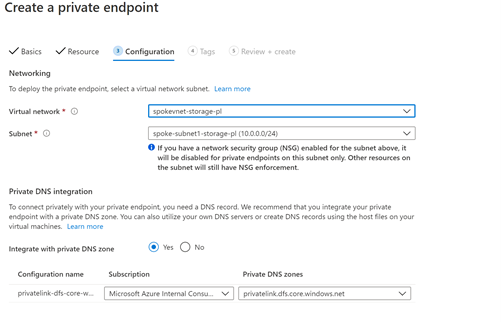
  
4. When ADB and Storage private endpoints are deployed in their respective VNets, there are some additional steps that need to be performed:

  a.The VNets should be [linked](https://docs.microsoft.com/en-us/azure/dns/private-dns-virtual-network-links) with the private DNS zone, as shown below (databricks-vnetpl and spkevnet-storage-pl):

   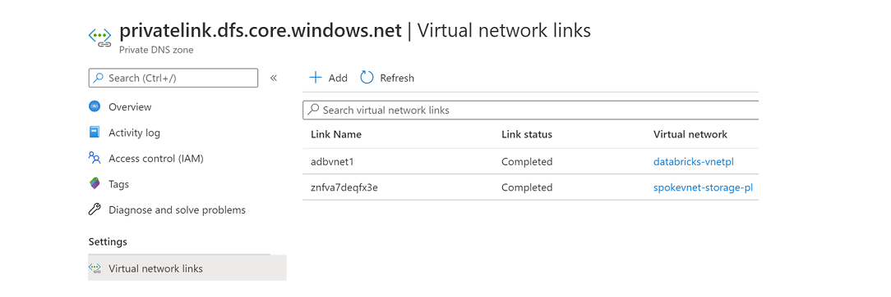

  b. Also make sure both ADB and storage endpoint VNETs are [peered](https://docs.microsoft.com/en-us/azure/virtual-network/virtual-network-peering-overview):
  
   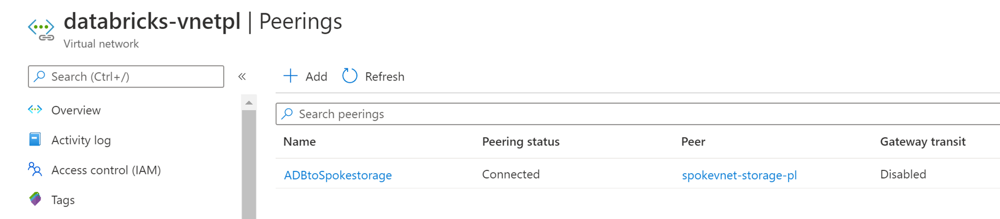
   
   The network configuration should now be as follows:
    
   
       
   c. Make sure the storage firewall is enabled. As an optional step you can also add the ADB VNet (databricks-vnet) to communicate with this storage account. When you enable this, storage endpoints will also be enabled on the ADB Vnet (databricks-vnet). 
  
   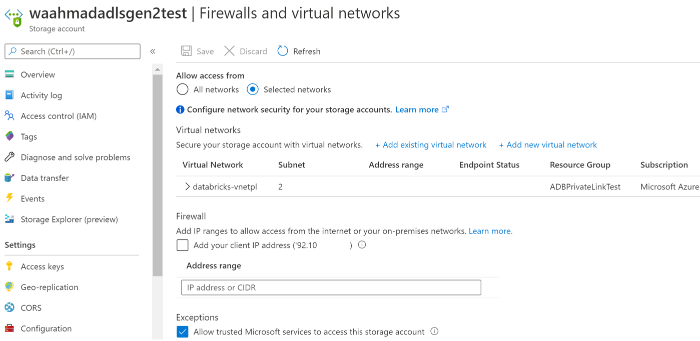
  
  5. In an ADB notebook you can double check if the FQDN of the storage is now resolving to private IP:
  
   
  
  6. A mount can be created as normal using the same FQDN and it will connect privately to ADLS using private endpoints.
  
   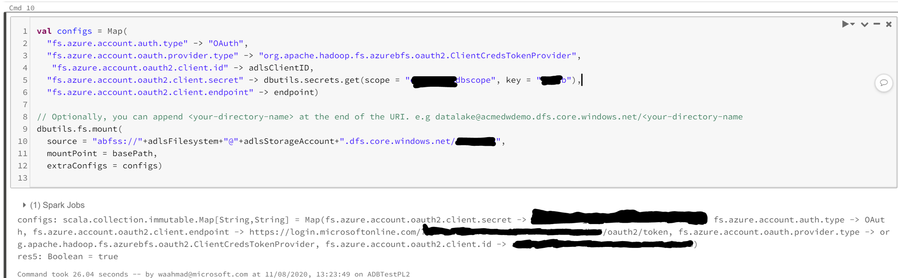

  If you are using a proxy then service principal authentication may fail. To avoid the error you can use the following environment variables  and specify your proxy URL:

  ```
  http_url: Proxy FQDN, https_url: Proxy FQDN
  ```

    Note: You can deploy the private endpoint for storage within the same VNet where ADB is injected but it should be a different subnet i.e. it must not be deployed in the ADB private or public subnets.
  
There are [further steps](https://databricks.com/blog/2020/03/27/data-exfiltration-protection-with-azure-databricks.html) one can take to harden the Databricks control plane using an Azure Firewall if required.

In the next few sections we will discuss the various approaches to authenticate and patterns to implement access control based on permissions.

## Pattern 1 - Access via Service Principal

To provide a group of users access to a particular folder (and it's
contents) in ADLS, the simplest mechanism is to create a [mount point
using a service
principal](https://docs.microsoft.com/en-gb/azure/databricks/data/data-sources/azure/azure-datalake-gen2?toc=https%3A%2F%2Fdocs.microsoft.com%2Fen-gb%2Fazure%2Fazure-databricks%2FTOC.json&bc=https%3A%2F%2Fdocs.microsoft.com%2Fen-gb%2Fazure%2Fbread%2Ftoc.json#--mount-an-azure-data-lake-storage-gen2-account-using-a-service-principal-and-oauth-20)
at the desired folder depth. The mount point (/mnt/\<mount\_name\>) is
created once-off per workspace but **is accessible to any user on any
cluster in that workspace**. In order to secure access to different
groups of users with different permissions, one will need more than just
a single one mount point in one workspace. One of the patterns described
below should be followed.

*Note access keys are not an option on ADLS whereas they can be used for
normal blob containers without HNS enabled.*

Below is sample code to authenticate via a SP using OAuth2 and create a
mount point in Scala.

```scala
configs = {"fs.azure.account.auth.type": "OAuth",
           "fs.azure.account.oauth.provider.type": "org.apache.hadoop.fs.azurebfs.oauth2.ClientCredsTokenProvider",
           "fs.azure.account.oauth2.client.id": "enter-your-service-principal-application-id-here",
           "fs.azure.account.oauth2.client.secret": dbutils.secrets.get(scope = "enter-your-key-vault-secret-scope-name-here", key = "enter-the-secret"),
           "fs.azure.account.oauth2.client.endpoint": "https://login.microsoftonline.com/enter-your-tenant-id-here/oauth2/token"}

dbutils.fs.mount(
  source = "abfss://file-system-name@storage-account-name.dfs.core.windows.net/folder-path-here",
  mount_point = "/mnt/mount-name",
```
The creation of the mount point and listing of current mount points in
the workspace can be done via the
[CLI](https://docs.microsoft.com/en-gb/azure/databricks/dev-tools/cli/dbfs-cli?toc=https%3A%2F%2Fdocs.microsoft.com%2Fen-gb%2Fazure%2Fazure-databricks%2FTOC.json&bc=https%3A%2F%2Fdocs.microsoft.com%2Fen-gb%2Fazure%2Fbread%2Ftoc.json)

```cli
\>databricks configure --- token

Databricks Host (should begin with ):
https://eastus.azuredatabricks.net/?o=#########
Token:dapi###############
\>databricks fs ls dbfs:/mnt

datalake
```

From an architecture perspective these are the basic components where
"dl" is used to represent the mount name.
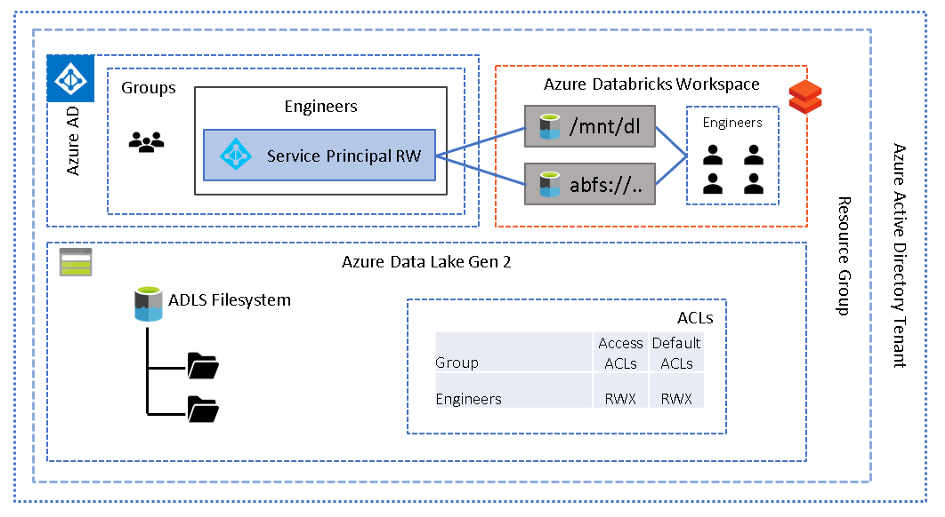

*Note the use of default ACLs otherwise any new folders created will be
inaccessible*

The mount point and ACLs could be at the filesystem (root) level or at
the folder level to grant access at the required filesystem depth.

Instead of mount points, access can also be via direct path --- Azure
Blob Filesystem (ABFS - included in runtime 5.2 and above) as shown in
the code snippet below.

To access data directly using service principal, authorisation code must
be executed in the same session prior to reading/writing the data for
example:
```scala
# authenticate using a service principal and OAuth 2.0
spark.conf.set("fs.azure.account.auth.type", "OAuth")
spark.conf.set("fs.azure.account.oauth.provider.type", "org.apache.hadoop.fs.azurebfs.oauth2.ClientCredsTokenProvider")
spark.conf.set("fs.azure.account.oauth2.client.id", "enter-your-service-principal-application-id-here")
spark.conf.set("fs.azure.account.oauth2.client.secret", dbutils.secrets.get(scope = "secret-scope-name", key = "secret-name"))
spark.conf.set("fs.azure.account.oauth2.client.endpoint", "https://login.microsoftonline.com//enter-your-tenant-id-here/oauth2/token")

# read data in delta format
readdf=spark.read.format("delta").load(abfs://file-system-name@storage-account-name.dfs.core.windows.net/path-to-data")
```

Using a single service principal to authenticate users to a single
location in the lake is unlikely to satisfy most security requirements
-- it is too coarse grained, much like RBAC on Blob containers. It does
not facilitate securing access to multiple groups of users of the lake
who require different sets of permissions. One or more the following
patterns may be followed to achieve the required level of
granularity.


## Pattern 2 - Multiple workspaces --- permission by workspace

This is an extension of the first pattern whereby multiple workspaces
are provisioned, and different groups of users are assigned to different
workspaces. Each group/workspace will use a different service principal
to govern the level of access required, either via a configured mount
point or direct path. Conceptually, this is a mapping of service
principal to each group of users, and each service principal will have a
defined set of permissions on the lake. In order to assign users to a
workspace simply ensure they are registered in your Azure Active
Directory (AAD) and an admin (those with [contributor or owner role on
the
workspace](https://docs.microsoft.com/en-us/azure/databricks/administration-guide/account-settings/account#assign-initial-account-admins)
will need to [add
users](https://docs.microsoft.com/en-us/azure/databricks/administration-guide/users-groups/users#--add-a-user)
(with the same identity as in AAD) to the appropriate workspace. The
architecture below depicts two different folders and two groups of users
(readers and writers) on each.

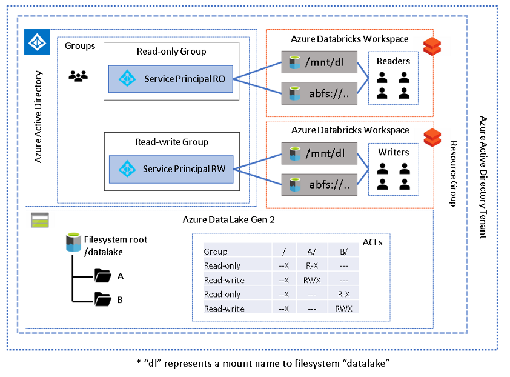

This pattern may offer excellent isolation at a workspace level however
the main disadvantage to this approach is the proliferation of
workspaces --- n groups = n workspaces. The workspace itself does not
incur cost, but there may be an inherit increase in total cost of
ownership. If more granular security is required than workspace level then
one of the following patterns may be more suitable.

## Pattern 3 - AAD Credential passthrough
AAD passthrough allows different groups of users to all work in the same
workspace and access data either via mount point or direct path
authenticated using their own credentials. The user's credentials are
passed through to ADLS gen2 and evaluated against the files and folder
ACLs. This feature is enabled at the cluster level under the advanced
options.

To [mount an ADLS filesystem or folder with AAD passthrough
enabled](https://docs.microsoft.com/en-us/azure/databricks/data/data-sources/azure/adls-passthrough#azure-data-lake-storage-gen2-1)
the following Scala may be used:
```scala
val configs = Map("fs.azure.account.auth.type" -> "CustomAccessToken",  "fs.azure.account.custom.token.provider.class" -> spark.conf.get("spark.databricks.passthrough.adls.gen2.tokenProviderClassName"))

// Optionally, you can add <directory-name> to the source URI of your mount point.
dbutils.fs.mount(
  source = "abfss://file-system-name@storage-account-name.dfs.core.windows.net/folder-path-here",
  mountPoint = "/mnt/mount-name",
  extraConfigs = configs)
```
Any user reading or writing via the mount point will have their
credentials evaluated. Alternatively, to access data directly without a
mount point simply use the abfs path on a cluster with AAD Passthrough
enabled, for example:
```scala
# read data in delta format using direct path
readdf = spark.read
.format("<file format>")
.load("abfss://<filesys>@<storageacc>.dfs.core.windows.net/<path>")
```
Originally this functionality was only available using [high
concurrency
clusters](https://docs.microsoft.com/en-gb/azure/databricks/data/data-sources/azure/adls-passthrough#enable-azure-data-lake-storage-credential-passthrough-for-a-high-concurrency-cluster)
and supported only Python and SQL notebooks, but recently [standard
clusters support for AAD
passthrough](https://docs.microsoft.com/en-gb/azure/databricks/data/data-sources/azure/adls-passthrough#--enable-azure-data-lake-storage-credential-passthrough-for-a-standard-cluster)
using R and Scala notebooks were announced. One major consideration
however for standard clusters, is that only [a single user can be
enabled per
cluster](https://docs.microsoft.com/en-us/azure/databricks/data/data-sources/azure/adls-passthrough#single-user).

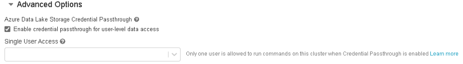

A subtle but important difference in this pattern is that service
principals are not required to delegate access, as it is the user's
credentials that are used.

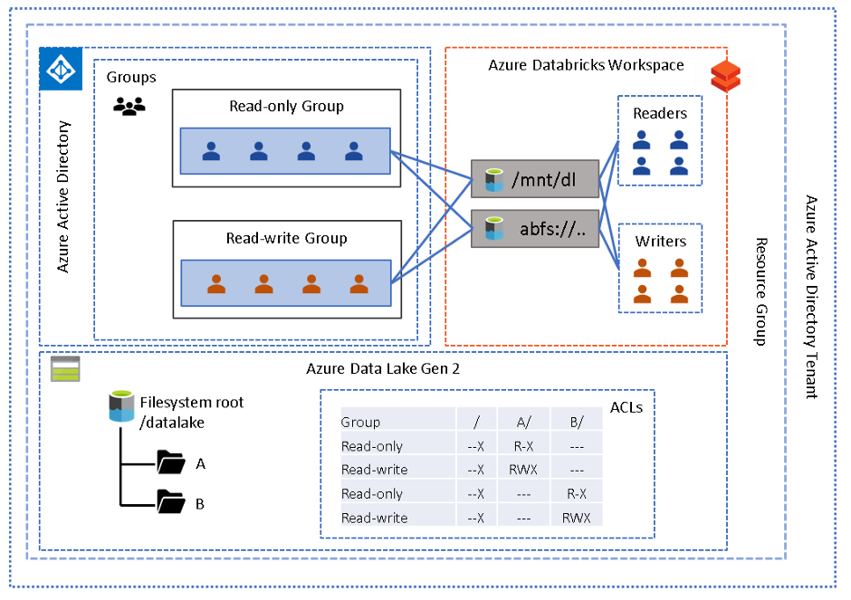

*Note: Access can still be either direct path or mount point*

There are some [[further
considerations]{.underline}](https://docs.microsoft.com/en-gb/azure/databricks/data/data-sources/azure/adls-passthrough#known-limitations)
to note at the time of writing:

-   The [[minimum runtime
    versions]{.underline}](https://docs.microsoft.com/en-gb/azure/databricks/data/data-sources/azure/adls-passthrough#supported-features)
    as well as which PySpark ML APIs which are not supported, and
    associated supported features

-   **Databricks Connect is not supported**

-   **[Jobs](https://docs.microsoft.com/en-gb/azure/databricks/jobs#jobs)**
    are not supported

-   jdbc/odbc (BI tools) is not yet supported

If any of these limitations present a challenge or there is a
requirement to enable more than one Scala or R developer to work on a
cluster at the same time, then you may need to consider one of the other
patterns below.

## Pattern 4 - Cluster scoped Service principal

In this pattern, each cluster is "mapped" to a unique service principal.
By [restricting users or groups to a particular
cluster](https://docs.microsoft.com/en-us/azure/databricks/administration-guide/access-control/cluster-acl#--configure-cluster-level-permissions),
using the "can attach to" permission, it will ensure that access to the
data lake is restricted by the ACLs assigned to the service principal.

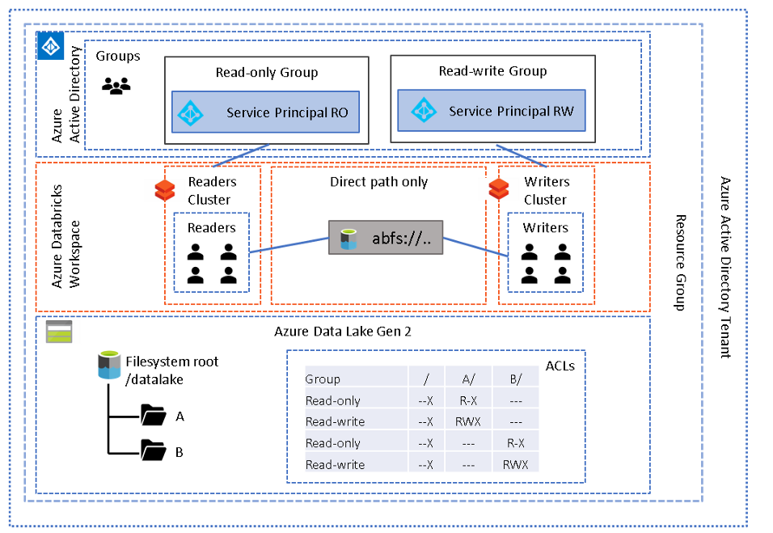

This pattern will allow you to use multiple clusters in the same
workspace, and "attach" a set of permissions according to the service
principal set in the [cluster
config](https://docs.microsoft.com/en-gb/azure/databricks/clusters/configure?toc=https%3A%2F%2Fdocs.microsoft.com%2Fen-gb%2Fazure%2Fazure-databricks%2FTOC.json&bc=https%3A%2F%2Fdocs.microsoft.com%2Fen-gb%2Fazure%2Fbread%2Ftoc.json):
```Scala
fs.azure.account.auth.type OAuth
fs.azure.account.oauth.provider.type org.apache.hadoop.fs.azurebfs.oauth2.ClientCredsTokenProvider
fs.azure.account.oauth2.client.id <service-principal-application-id>
fs.azure.account.oauth2.client.secret {{secrets/<your scope name>/<secret name>}}
fs.azure.account.oauth2.client.endpoint https://login.microsoftonline.com/<tenant id>/oauth2/token
```

*Note the method in which secrets are referenced in the config section
as it is different from the usual dbutils syntax*

The benefit of this approach is that the scope and secret names are not
exposed to end-users and they do not require read access to the secret
scope however the creator of the cluster will.

Users should use the direct access method, via ABFS, and mount points
should be forbidden, unless of course there is a global folder everyone
in the workspace needs access to. Until there is an in-built way to
prevent mount points being created, you may wish to write an alert
utility which runs frequently checking for any mount points using the
CLI (as shown in the first pattern) and sends a notification if any
unauthorised mount points are detected.

This pattern could be useful when both engineers and analysts require
different sets of permissions and assigned to the same workspace. The
engineers may need read access to one or more source data sets and then
write access to a target location, with read-write access to a staging
or working location. This requires a single service principal to have
access to all the data sets in order for the code to execute fully ---
more about this in the next pattern. The analysts however may need read
access to the target folder and nothing else.

The disadvantage of this approach is dedicated clusters for each
permission group, i.e. no sharing of clusters across permission groups.
In other words, each service principal, and therefore each cluster,
should have sufficient permissions in the lake to run the desired
workload on that cluster. The reason for this is that a cluster can only
be configured with a single service principal at a time. In a production
scenario the config should be specified through scripting the
provisioning of clusters using the CLI or API.

Depending on the number of permission groups required, this pattern
could result in a proliferation of clusters. The next pattern may
overcome this challenge but will require each user to execute
authentication code at run time.

## Pattern 5 - Session scoped Service principal

In this pattern, access control is governed at the session level so a
cluster may be shared by multiple groups of users, each using a set of
service principal credentials. *Normally, clusters with a number of
concurrent users and jobs will require a [high
concurrency](https://docs.microsoft.com/en-gb/azure/databricks/clusters/configure#--high-concurrency-clusters)
cluster to ensure resources are shared fairly.* The user attempting to
access ADLS will need to use the direct access method and execute the
OAuth code prior to accessing the required folder. Consequently, this
approach will not work when using odbc/jdbc connections. Also note, that
**only one service principal can be set in session at a time** and this
will have a significant influence the design based on Spark's lazy
evaluation, as described later. Below is sample OAuth code, which is
very similar to the code used in pattern 1 above:
```Scala
# authenticate using a service principal and OAuth 2.0
spark.conf.set("fs.azure.account.auth.type", "OAuth")
spark.conf.set("fs.azure.account.oauth.provider.type", "org.apache.hadoop.fs.azurebfs.oauth2.ClientCredsTokenProvider")
spark.conf.set("fs.azure.account.oauth2.client.id", "enter-your-service-principal-application-id-here")
spark.conf.set("fs.azure.account.oauth2.client.secret", dbutils.secrets.get(scope = "secret-scope-name", key = "secret-name"))
spark.conf.set("fs.azure.account.oauth2.client.endpoint", "https://login.microsoftonline.com//enter-your-tenant-id-here/oauth2/token")

# read data in delta format
readdf=spark.read.format("delta").load(abfs://file-system-name@storage-account-name.dfs.core.windows.net/path-to-data")
```
This pattern works well where different permission groups (such as
analysts and engineers) are required but one does not wish to take on
the administrative burden of isolating the user groups by cluster. *As
in the previous approach, mounting folders using the provided service
principal/secret scope details should be forbidden.*

The mechanism which ensures that each group has the appropriate level of
access is through their ability to "use" a service principal which has
been added to the AAD group with the desired level of access. The way to
effectively "map" the user group's level of access to a particular
service principal is by granting the Databricks user group access to the
secret scope (see below) which stores the credentials for that service
principal. Armed with the secret scope name and the associated key
name(s), users can then run the authorisation code shown above. The
"client.secret" (service principal's secret) is stored as a secret in
the secret scope but so to can any other sensitive details such as the
service principals application ID and tenant ID.

The disadvantage to this approach is the **proliferation of secret
scopes of which there is a limit of 100 per workspace**. Additionally
the [premium
plan](https://databricks.com/product/azure-pricing) is
required in order to assign granular permissions to the secret scope.

To help explain this pattern further, and the setup required, examine
the following simple scenario:

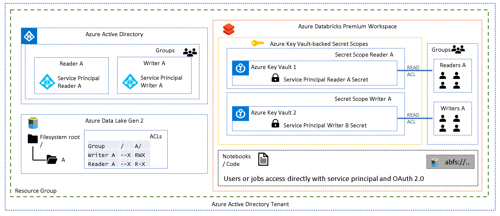

The above diagram depicts a single folder (A) with two sets of
permissions, readers and writers. AAD groups reflect these roles and
have been assigned appropriate folder ACLs. Each AAD group contains a
service principal and the credentials for each service principal have
been stored in a unique secret scope. Each
[group](https://docs.microsoft.com/en-us/azure/databricks/administration-guide/users-groups/groups)
in the Databricks workspace contains the appropriate users, and the
group has been [assigned READ
ACLs](https://docs.microsoft.com/en-us/azure/databricks/dev-tools/cli/secrets-cli)
on the associated secret scope, which allows a group of users to "use"
the service principal mapped to their level of permission.

Below is an example CLI command of how to grant read permissions to the
"GrWritersA" Databricks group on "SsWritersA" secret scope. Note that
ACLs are at secret scope level, not at secret level which means that one
secret scope will be required per service principal.
```CLI
databricks secrets put-acl --scope SsWritersA --principal GrWritersA --permission READ
databricks secrets get-acl --scope SsWritersA --principal GrWritersA
Principal Permission
 — — — — — — — — — — — — 
GrWritersA READ
```
How this is may be implemented for your data lake scenario requires
careful thought and planning. In very general terms this pattern being
applied in one of two ways, at folder granularity, representing a
department or data lake zone (1) or at data project or "data module"
granularity (2):

1.  Analysts (read-only) and engineers (read-write) are working within a
    single folder structure, and they do not require access to
    additional datasets outside of their current directory. The diagram
    below depicts two folders A and B, perhaps representing two
    departments. Each department has their own analysts and engineers
    working on their data, and should not be allowed access to the other
    department's data.

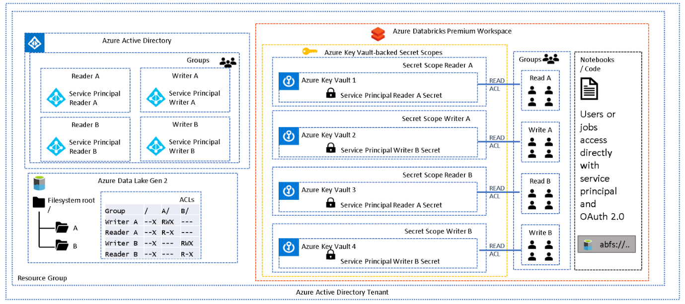

2.  Using the diagram below for reference, engineers and analysts are
    working on different projects and should have clear separation of
    concerns. Engineers working on "Module 1" require read access to
    multiple source data assets (A & B). Transformations and joins are
    run to produce another data asset ( C ). Engineers also require a
    working or staging directory to persisting output during various
    stages (X). For the entire pipeline to execute, "Service Principal
    for Module 1 Developers" has been added to the relevant AAD groups
    which provide access to all necessary folders (A, B, X, C) through
    the assigned ACLs.

    Analysts need to produce analytics using the new data asset ( C )
    but should not have access to the source data, therefore, they use
    the "Service Principal for Dataset C" which was added to the Readers
    C group only.

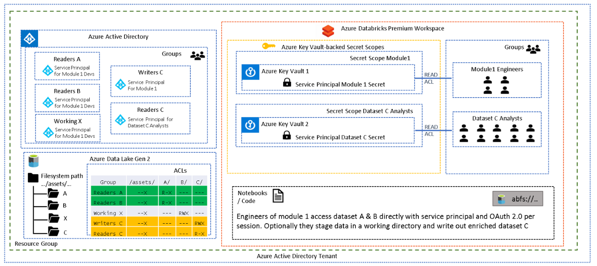

It may seem more logical to have one service principal per data asset
but when multiple permissions are required for a single pipeline to
execute in Spark, then one needs to consider how [lazy
evaluation](https://data-flair.training/blogs/apache-spark-lazy-evaluation/)
works. When attempting to use multiple service principals in the same
notebook/session one needs to remember that the read and write will be
executed only once the write is triggered. One cannot therefore set the
authentication to one service principal for one folder and then to
another prior to the final write operation, all in the same
notebook/session, as the read operation will be executed only when the
write is triggered.

*This means a single service principal will need to encapsulate the
permissions of a single pipeline execution rather than a single service
principal per data asset.

## Pattern 6 - Databricks Table Access Control


One final pattern, which not technically an access pattern to ADLS,
implements security at the table (or view) level rather than the data
lake level. This method is native to Databricks and involves granting,
denying, revoking access to tables or views which may have been created
from files residing in ADLS. Access is granted programmatically (from
Python or SQL) to tables or views based on user/group. This approach
requires [both cluster and table access
control](https://docs.microsoft.com/en-gb/azure/databricks/administration-guide/access-control/table-acls/table-acl#enable-table-access-control-at-the-account-level)
to be enabled and requires a [premium tier
workspace](https://databricks.com/product/azure-pricing).
File access is disabled through a [cluster level
configuration](https://docs.microsoft.com/en-gb/azure/databricks/administration-guide/access-control/table-acls/table-acl#sql-only-table-access-control)
which ensures the only method of data access for users is via the
pre-configured tables or views. This works well for analytical (BI)
tools accessing tables/views via odbc but limits users in their ability
to access files directly and does not support R and Scala.

## Conclusion

This white paper has examined a number of access patterns to Azure Data
Lake gen2 available from Azure Databricks. There are merits and
disadvantages of each, and most likely it will be a combination of these
patterns which will suit a production scenario. Below is a table
summarising the above access patterns and some important considerations
of each.

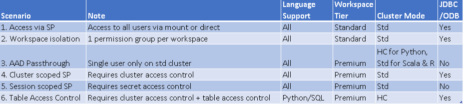

## License/Terms of Use

This is a free white paper released into the public domain.

Anyone is free to use or distribute this white paper, for any purpose,
commercial or non-commercial, and by any means.

THE WHITE PAPER IS PROVIDED \"AS IS\", WITHOUT WARRANTY OF ANY KIND,
EXPRESS OR IMPLIED, INCLUDING BUT NOT LIMITED TO THE WARRANTIES OF
MERCHANTABILITY, FITNESS FOR A PARTICULAR PURPOSE AND NONINFRINGEMENT.

IN NO EVENT SHALL THE AUTHORS BE LIABLE FOR ANY CLAIM, DAMAGES OR OTHER
LIABILITY, WHETHER IN AN ACTION OF CONTRACT, TORT OR OTHERWISE, ARISING
FROM, OUT OF OR IN CONNECTION WITH THE WHITE PAPER.

