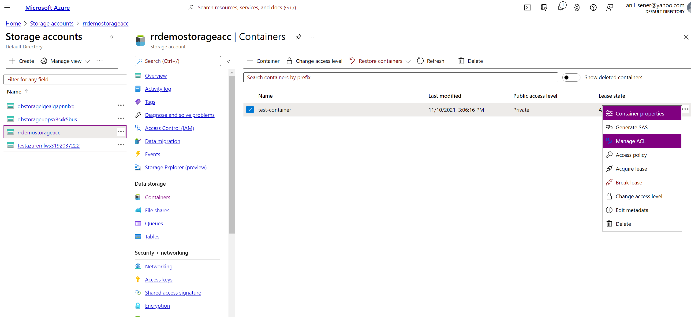
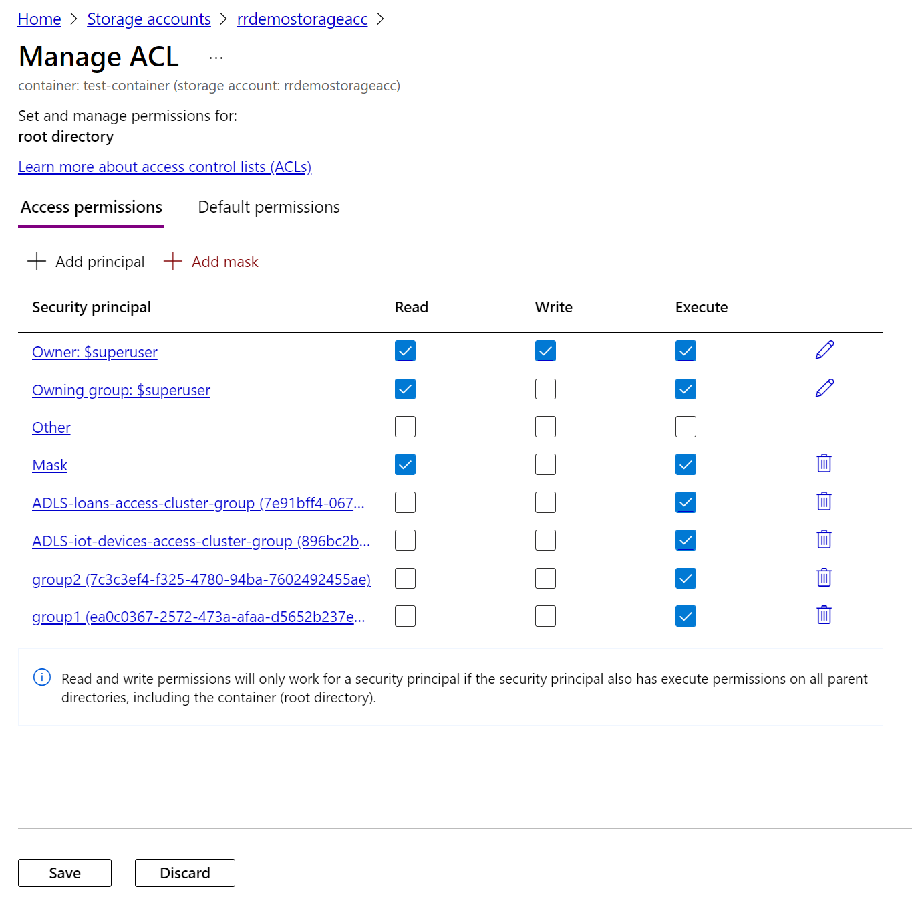
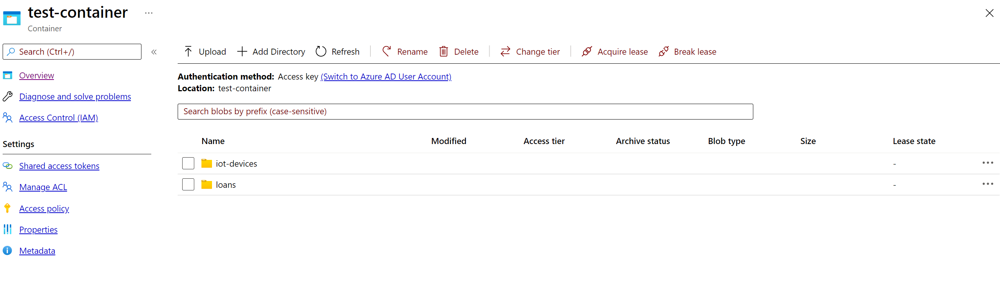
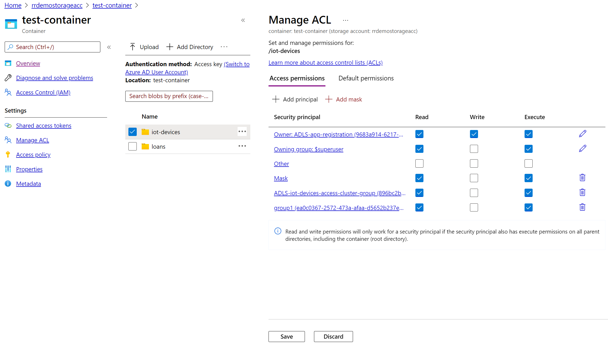
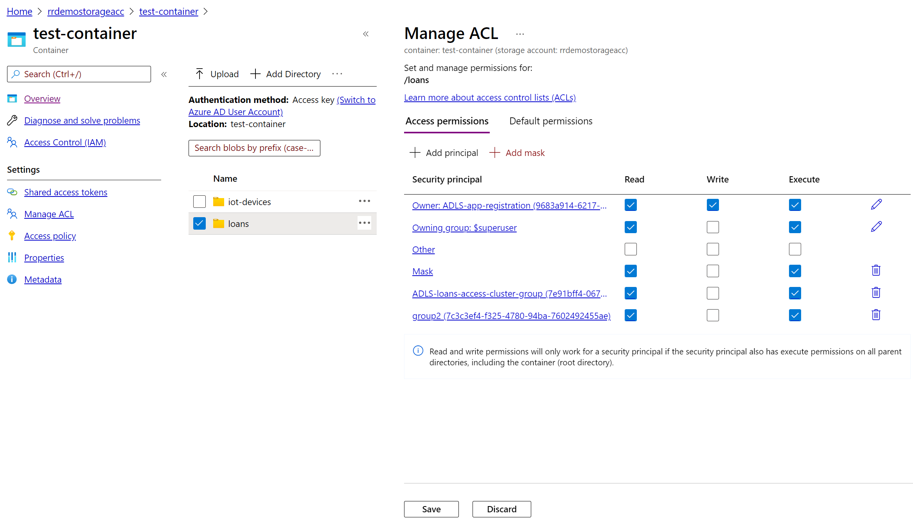
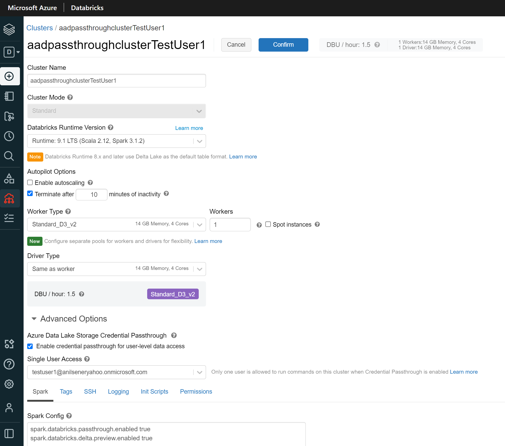
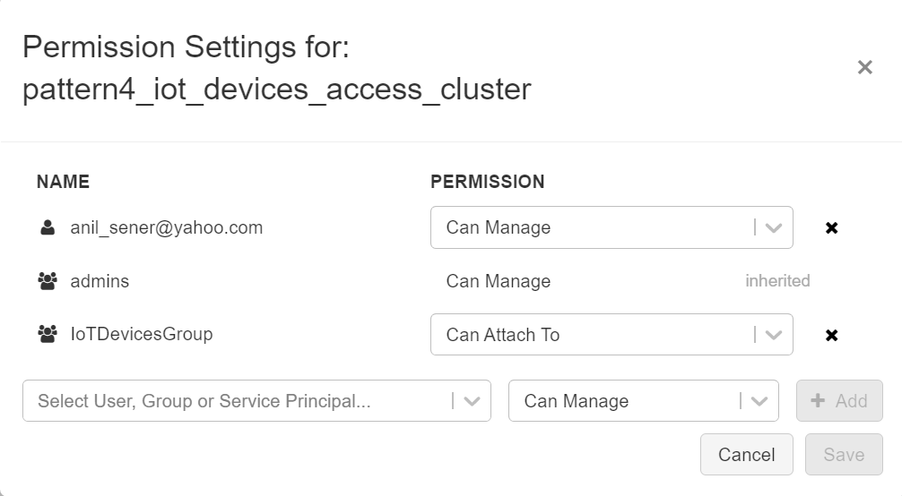
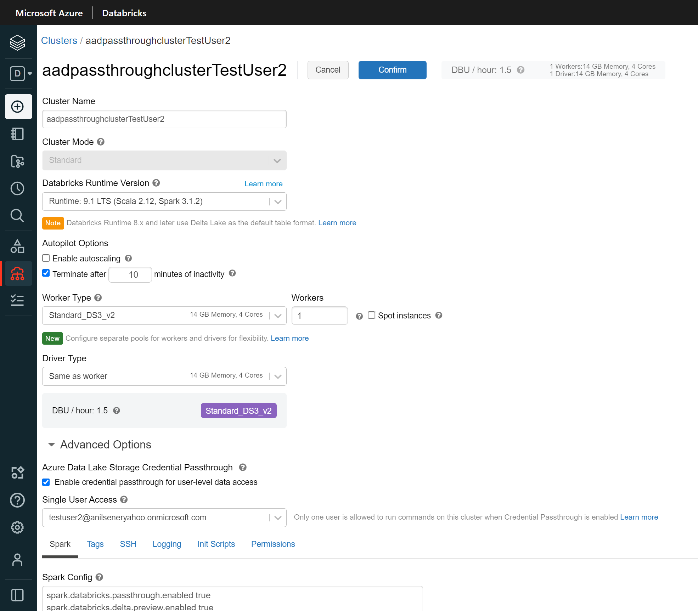
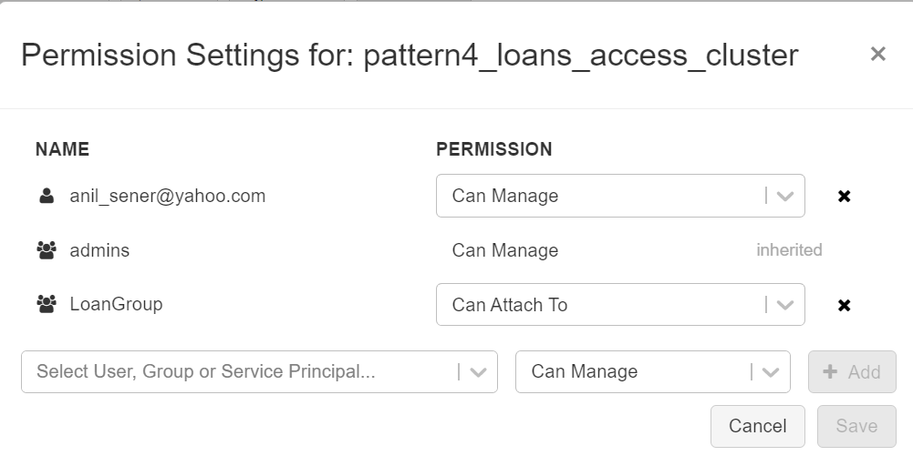
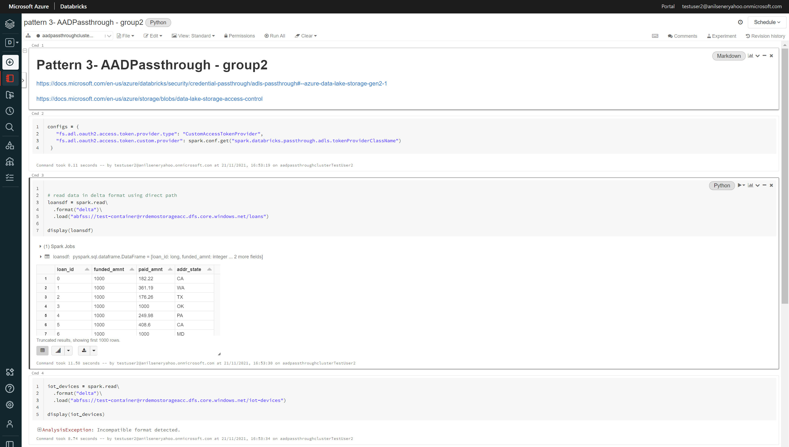

# Tutorial for Pattern 3: Azure Active Directory Credential passthrough

**Summary:**

This document provides links to a tutorial on implementing Pattern 3: Azure Active Directory Credential passthrough

**Versions:**

| **Name** | **Title** | **Notes** | **Date** |
| --- | --- | --- | --- |
| Anil Sener | Microsoft Cloud Solution Architect – Data &amp; AI | Original | 01 December 2021 |
|   |   |   |   |

# Contents

[Tutorial Steps](#Tutorial-Steps)

[Pre-requisites](#Pre-requisites)

[License/Terms of Use](#License/Terms-of-Use)

## Pre-requisites

This tutorial requires the completion of the steps in [Connecting securely to ADLS from ADB](../../Readme.md#connecting-securely-to-adls-from-adb) section.

This tutorial requires the completion of the steps in the [preparation](../preparation/Readme.md) section.

This tutorial requires a premium Databricks Workspace.

Install [Databricks Client](https://docs.databricks.com/dev-tools/cli/index.html).

## Tutorial Steps
1. Navigate to the <b>Storage Accounts</b>, drill down to the storage account created in the setup steps and navigate to <b>Containers</b> to display <b>test_container</b>. Then, click <b>...</b> icon on the rightern side of the container and select <b>Manage ACLs</b>:

  

2. When the ACLs for the container are displayed, add the principals for the active directory groups called <b>group1</b> and <b>group2</b> which should be already created as a part of preparation steps. Please check only <b>Execute</b> right for these principals and click to <b>Save</b> button:

  

3. Click on <b>test_container</b> and then you should be able to see the folders inside the container. Then, click <b>...</b> icon on the rightern side of the <b>iot_devices</b> folder and select <b>Manage ACLs</b>:

  

4. When the ACLs for the <b>iot_devices</b> folder are displayed, add the principals for the active directory group <b>group1</b> and check <b>Read</b> and <b>Execute</b> and click to <b>Save</b> button:

  

5. When the ACLs for the <b>loans</b> folder are displayed, add the principals for the active directory group <b>group2</b> and check <b>Read</b> and <b>Execute</b> and click to <b>Save</b> button:

  

6. Navigate to the <b>premium Azure Databricks Workspace > Overview</b> and click <b>Launch Workspace</b> button, choose and <b>an admin</b> user to login. When Azure Databricks Workspace is displayed, navigate to <b>Compute</b>. Then, create a Standard cluster for <b>TestUser1</b> enabling the credential passthrough with the following settings. Set the permissions to allow <b>IoTDevicesGroup</b> to attach this cluster: 

  

  

7. Then, create another Standard cluster for <b>TestUser2</b> enabling the credential passthrough with the following settings.Set the permissions to allow <b>LoanGroup</b> to attach this cluster: 

  

  

8. Navigate to the premium Azure Databricks <b>Workspace > Overview</b> on Azure Portal and click <b>Launch Workspace</b> button, choose and <b>TestUser1</b> user to login. When Azure Databricks Workspace is displayed, navigate to <b>Workspace</b>, then upload [pattern3-AADPassthrough-group1.ipynb](notebooks\testuser1\pattern3-AADPassthrough-group1.ipynb) notebook to the Databricks Workspace and open the notebook, attach & start the cluster created in step 6 and then run all cells: 

  

<i>RESULT: Files unders /iot_devices folder are readable meanwhile /loans raise an exception due to lack of privileges to access these files on ADLS Gen2. These permissions are limited thanks to the privileges of group1 on ADLS Gen2 ACLs.</i> 

9. Navigate to the premium Azure Databricks <b>Workspace > Overview</b>on Azure Portal and click <b>Launch Workspace</b> button, choose and <b>TestUser2</b> user to login. When Azure Databricks Workspace is displayed, navigate to <b>Workspace</b>, then upload [pattern3-AADPassthrough-group2.ipynb](notebooks\testuser2\pattern3-AADPassthrough-group2.ipynb) notebook to the Databricks Workspace and open the notebook, attach & start the cluster created in step 7 and then run all cells:  

  

<i>RESULT: Files unders /loans folder are readable meanwhile /iot_devices raise an exception due to lack of privileges to access these files on ADLS Gen2. These permissions are limited thanks to the privileges of group1 on ADLS Gen2 ACLs.</i> 

## License/Terms of Use

This is a free white paper released into the public domain.

Anyone is free to use or distribute this white paper, for any purpose,
commercial or non-commercial, and by any means.

THE WHITE PAPER IS PROVIDED \"AS IS\", WITHOUT WARRANTY OF ANY KIND,
EXPRESS OR IMPLIED, INCLUDING BUT NOT LIMITED TO THE WARRANTIES OF
MERCHANTABILITY, FITNESS FOR A PARTICULAR PURPOSE AND NONINFRINGEMENT.

IN NO EVENT SHALL THE AUTHORS BE LIABLE FOR ANY CLAIM, DAMAGES OR OTHER
LIABILITY, WHETHER IN AN ACTION OF CONTRACT, TORT OR OTHERWISE, ARISING
FROM, OUT OF OR IN CONNECTION WITH THE WHITE PAPER.

