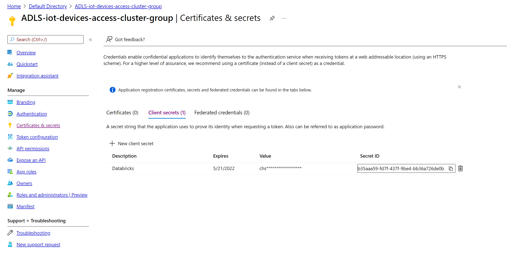

# Tutorial for Pattern 4: Cluster Scoped Service Principal

**Summary:**

This document provides links to a tutorial on implementing Pattern 4: Cluster Scoped Service Principal

**Versions:**

| **Name** | **Title** | **Notes** | **Date** |
| --- | --- | --- | --- |
| Anil Sener | Microsoft Cloud Solution Architect – Data & AI | Original | 01 December 2021 |
|   |   |   |   |

# Contents

[Pre-requisites](#Pre-requisites)

[Tutorial Steps](#Tutorial-Steps)

[License/Terms of Use](#License/Terms-of-Use)

## Pre-requisites

This tutorial requires the completion of the steps in [Connecting securely to ADLS from ADB](../../Readme.md#connecting-securely-to-adls-from-adb) section.

This tutorial requires the completion of the steps in the [preparation](../preparation/Readme.md) section.

This tutorial requires a premium Databricks Workspace.

Install [Databricks Client](https://docs.databricks.com/dev-tools/cli/index.html).

## Tutorial Steps
1. Navigate to <b>Azure Active Directory > App registrations</b> and create two application registration service principals one for loans and another for iot_devices:
<p align="center">
  
</p>

2. Drill down to app registration created for iot_devices and navigate to <b>Certificates & secrets > Client secrets</b> and create a secret and copy the secret value to be used in KeyVault in the later steps:
<p align="center">
  
</p>

3. Drill down to app registration created for loans and navigate to <b>Certificates & secrets > Client secrets/</b> and create a secret and copy the secret value to be used in KeyVault in the later steps:
<p align="center">
  
</p>

4. Navigate to the KeyVaults and search for the Keyvault called <b>rr-demo</b> which is created during the setup process, then navigate to <b>Secrets</b> and create two secrets for iot_devices and loans using the client secret values generated in step 2 and 3:
<p align="center">
  
</p>

5. When the ACLs for the container are displayed, add the principals for App registrations created in step 1. Please check only <b>Execute</b> right for these principals and click to <b>Save</b> button:
<p align="center">
  
</p>

6. Click on <b>test_container</b> and then you should be able to see the folders inside the container. Then, click <b>...</b> icon on the rightern side of the <b>iot_devices</b> folder and select <b>Manage ACLs</b>:
<p align="center">
  
</p>

7. When the ACLs for the <b>iot_devices</b> folder are displayed, add the principals for the app registration service principal created for iot_devices and check <b>Read</b> and <b>Execute</b> and click to <b>Save</b> button:
<p align="center">
  
</p>

8. When the ACLs for the <b>loans</b> folder are displayed, add the principals for the app registration service principal created for iot_devices and check <b>Read</b> and <b>Execute</b> and click to <b>Save</b> button:
<p align="center">
  
</p>

9. Navigate to the <b>premium Azure Databricks Workspace > Overview</b> and click <b>Launch Workspace</b> button, choose and <b>admin user</b> to login. When Azure Databricks Workspace is displayed, navigate to <b>Settings > User Settings</b> and then click the <b>Generate New Token</b> button. Copy the token.

10. Launch a commandline application in you pc and use [Databricks Client](https://docs.databricks.com/dev-tools/cli/index.html) to execute the following command to configure the databricks client with the workspace providing your premium workspace url and token generated in the previous step:
```sh
databricks configure --token 
```

11. After the [Databricks Client](https://docs.databricks.com/dev-tools/cli/index.html) configuration execute the following commands to create 2 Databricks secret scopes for iot_devices and loans and to create one Databricks secret per each to be referred in the subsequent steps in this tutorial. Please remember to replace `<subscription-id>` with your own in each command below:

```sh
databricks secrets create-scope --scope  iot-group-scope --scope-backend-type AZURE_KEYVAULT --resource-id /subscriptions/<subscription-id>/resourceGroups/RR-demo/providers/Microsoft.KeyVault/vaults/rr-demo-kv  --dns-name https://rr-demo-kv.vault.azure.net/

databricks secrets put-acl --scope  iot-group-scope  --principal  IoTDevicesGroup --permission READ

databricks secrets create-scope --scope  loan-group-scope --scope-backend-type AZURE_KEYVAULT --resource-id /subscriptions/<subscription-id>/resourceGroups/RR-demo/providers/Microsoft.KeyVault/vaults/rr-demo-kv  --dns-name https://rr-demo-kv.vault.azure.net/

databricks secrets put-acl --scope loan-group-scope --principal  LoanGroup --permission READ
```

<i>These commands will limit access of Databricks groups only to the app registration service principals relavant to their group. Ideally, we should have created separate Azure key vaults for each secret scope.</i> 

12. Navigate to the <b>premium Azure Databricks Workspace > Overview</b> and click <b>Launch Workspace</b> button, choose and <b>admin user</b> to login. When Azure Databricks Workspace is displayed, navigate to <b>Compute</b> and then create a cluster to be used by IoTDevices group by setting the Spark Configuration as below. Set the permissions to allow <b>IoTDevicesGroup</b> to attach this cluster. Please remember to replace `<iot-devices-group-service-principal-application-id>`,`<secret name>` and `<Directory-ID>` (your Azure Tenant ID):

```
fs.azure.account.auth.type OAuth
fs.azure.account.oauth.provider.type org.apache.hadoop.fs.azurebfs.oauth2.ClientCredsTokenProvider
fs.azure.account.oauth2.client.id <iot-devices-group-service-principal-application-id>
fs.azure.account.oauth2.client.secret {{secrets/iot-group-scope/<secret name>}}
fs.azure.account.oauth2.client.endpoint https://login.microsoftonline.com/<Directory-ID>/oauth2/token
```

<p align="center">
  
</p>

<p align="center">
  
</p>

13. Create another cluster to be used by LoanGroup group by setting the Spark Configuration as below. Set the permissions to allow <b>LoanGroup</b> to attach this cluster. Please remember to replace `<loan-group-service-principal-application-id>`,`<secret name>` and `<Directory-ID>` (your Azure Tenant ID)::

```
fs.azure.account.auth.type OAuth
fs.azure.account.oauth.provider.type org.apache.hadoop.fs.azurebfs.oauth2.ClientCredsTokenProvider
fs.azure.account.oauth2.client.id <loan-group-service-principal-application-id>
fs.azure.account.oauth2.client.secret {{secrets/loan-group-scope/<secret name>}}
fs.azure.account.oauth2.client.endpoint https://login.microsoftonline.com/<Directory-ID>/oauth2/token
```

<p align="center">
  
</p>

<p align="center">
  
</p>

14. Navigate to the premium Azure Databricks <b>Workspace > Overview</b> on Azure Portal and click <b>Launch Workspace</b> button, choose and <b>TestUser1</b> user to login. When Azure Databricks Workspace is displayed, navigate to <b>Workspace</b>, then upload [pattern4-Cluster-scoped-principals-iot_devices.ipynb](notebooks/testuser1/pattern4-Cluster-scoped-principals-iot_devices.ipynb) notebook to the Databricks Workspace and open the notebook, attach & start the cluster created in step 12 and then run all cells: 
<p align="center">
  
</p>

<i>RESULT: Files unders /iot_devices folder are readable meanwhile /loans raise an exception due to lack of privileges to access these files on ADLS Gen2. These permissions are limited thanks to the privileges of app registration service principal created for iot_devices on ADLS Gen2 ACLs.</i> 

15. Navigate to the premium Azure Databricks <b>Workspace > Overview</b> on Azure Portal and click <b>Launch Workspace</b> button, choose and <b>TestUser2</b> user to login. When Azure Databricks Workspace is displayed, navigate to <b>Workspace</b>, then upload [pattern4-Cluster-scoped-principals-loans.ipynb](notebooks/testuser2/pattern4-Cluster-scoped-principals-loans.ipynb) notebook to the Databricks Workspace and open the notebook, attach & start the cluster created in step 13 and then run all cells: 
<p align="center">
  
</p>

<i>RESULT: Files unders /loans folder are readable meanwhile /iot_devices raise an exception due to lack of privileges to access these files on ADLS Gen2. These permissions are limited thanks to the privileges of app registration service principal created for loans on ADLS Gen2 ACLs.</i> 

## License/Terms of Use

This is a free white paper released into the public domain.

Anyone is free to use or distribute this white paper, for any purpose,
commercial or non-commercial, and by any means.

THE WHITE PAPER IS PROVIDED \"AS IS\", WITHOUT WARRANTY OF ANY KIND,
EXPRESS OR IMPLIED, INCLUDING BUT NOT LIMITED TO THE WARRANTIES OF
MERCHANTABILITY, FITNESS FOR A PARTICULAR PURPOSE AND NONINFRINGEMENT.

IN NO EVENT SHALL THE AUTHORS BE LIABLE FOR ANY CLAIM, DAMAGES OR OTHER
LIABILITY, WHETHER IN AN ACTION OF CONTRACT, TORT OR OTHERWISE, ARISING
FROM, OUT OF OR IN CONNECTION WITH THE WHITE PAPER.

