# Tutorial for Pattern 6: Databricks Tables Access Control

**Summary:**

This document provides links to a tutorial on implementing Pattern 6: Databricks Tables Access Control.
It is highly recommended to check [Databricks SQL security model and data access overview](https://docs.microsoft.com/en-us/azure/databricks/sql/user/security/data-access-overview) to gain better understanding of this approach.

**Versions:**

| **Name** | **Title** | **Notes** | **Date** |
| --- | --- | --- | --- |
| Anil Sener | Microsoft Cloud Solution Architect – Data &amp; AI | Original | 01 December 2021 |
|   |   |   |   |

# Contents

[Pre-requisites](#Pre-requisites)

[Tutorial Steps](#Tutorial-Steps)

[License/Terms of Use](#License/Terms-of-Use)

## Pre-requisites

This tutorial requires the completion of the steps in [Connecting securely to ADLS from ADB](../../Readme.md#connecting-securely-to-adls-from-adb) section.

This tutorial requires the completion of the steps in the [preparation](../preparation/Readme.md) section.

This tutorial requires a premium Databricks Workspace.

## Tutorial Steps
1. Navigate to the <b>premium Azure Databricks Workspace > Overview</b> on Azure Portal and click <b>Launch Workspace</b> button, choose and <b>admin user</b> to login. When Azure Databricks Workspace is displayed, navigate to <b>Compute</b> and then create a <b>High Concurrency</b> cluster, enable Table Access Control for this cluster and set the Spark Configuration as below. Set the permissions to allow <b>LoanGroup</b> and <b>IoTDevicesGroup</b> to attach this cluster:

<p align="center">
  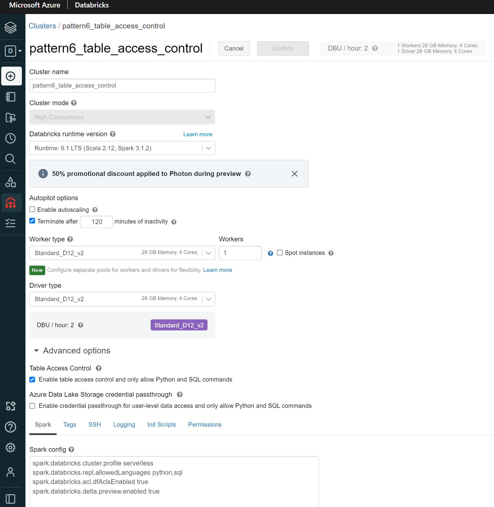
</p>

<p align="center">
  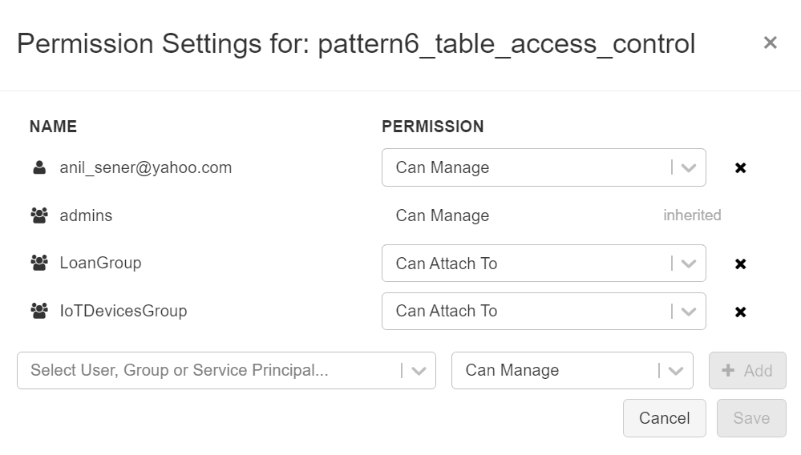
</p>

2. Navigate to <b>SQL</b> on Databricks Menu:
<p align="center">
  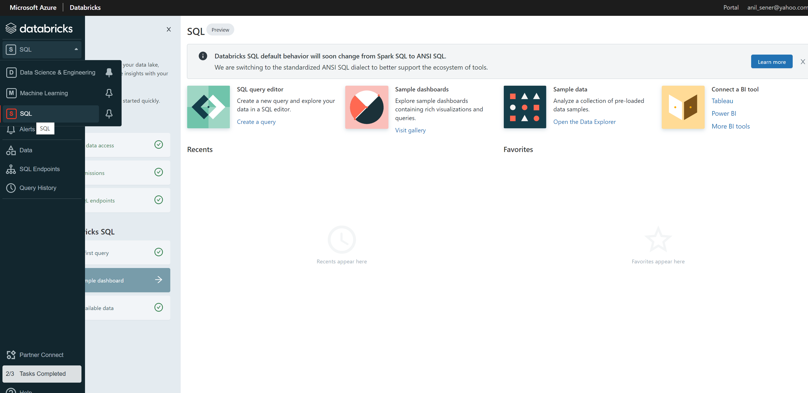
</p>

3. Navigate to <b>Configure data access > SQL Endpoint Settings</b> and [add a Service Principal](https://docs.microsoft.com/en-us/azure/databricks/sql/admin/data-access-configuration#storage-access) as follows. Please remember to replace `<storage-account-name>`,`<app-registration-client-id>`,`<databricks-secret-scope-name>`,`<databricks-secret-key>` and `<Directory-ID>` (your Azure Tenant ID). You can use the `<app-registration-client-id>`,`<databricks-secret-scope-name>` and `<databricks-secret-key>` from the App Registration and ADB Secrets in [Connecting securely to ADLS from ADB](../../Readme.md#connecting-securely-to-adls-from-adb) section:

```
spark.hadoop.fs.azure.account.auth.type.<storage-account-name>.dfs.core.windows.net OAuth
spark.hadoop.fs.azure.account.oauth.provider.type.<storage-account-name>.dfs.core.windows.net org.apache.hadoop.fs.azurebfs.oauth2.ClientCredsTokenProvider
spark.hadoop.fs.azure.account.oauth2.client.id.<storage-account-name>.dfs.core.windows.net <app-registration-client-id>
spark.hadoop.fs.azure.account.oauth2.client.secret.<storage-account-name>.dfs.core.windows.net {{secrets/<databricks-secret-scope-name>/<databricks-secret-key>}}
spark.hadoop.fs.azure.account.oauth2.client.endpoint.<storage-account-name>.dfs.core.windows.net https://login.microsoftonline.com/<Directory-ID>/oauth2/token
```

<p align="center">
  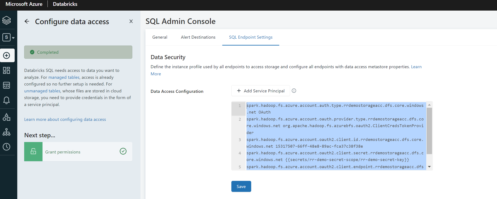
</p>


4. Navigate back to the main SQL screen and then navigate to <b>Review SQL endpoints</b> on the home screen (or navigate to SQL Endpoints in the Databricks Menu on the left) and click <b>Create SQL Enpoint</b> button to create and SQL endpoint with the following settings.
<p align="center">
  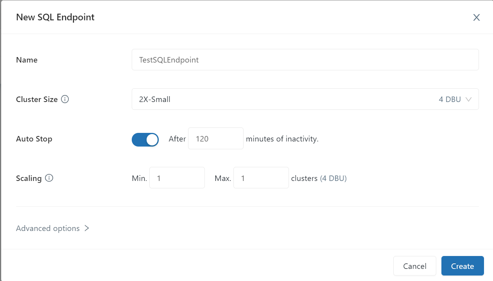
</p>

5. Start the SQL Endpoint clicking on start button next to the SQL endpoint that you have created. It might take few minutes to observe the SQL Endpoint to move to Running State:
<p align="center">
  
</p>

<p align="center">
  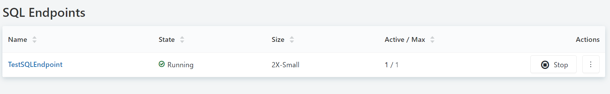
</p>


6. When the SQL endpoint started, navigate to <b>Queries</b> in the Databricks Menu and click <b>Create Query</b> button:
<p align="center">
  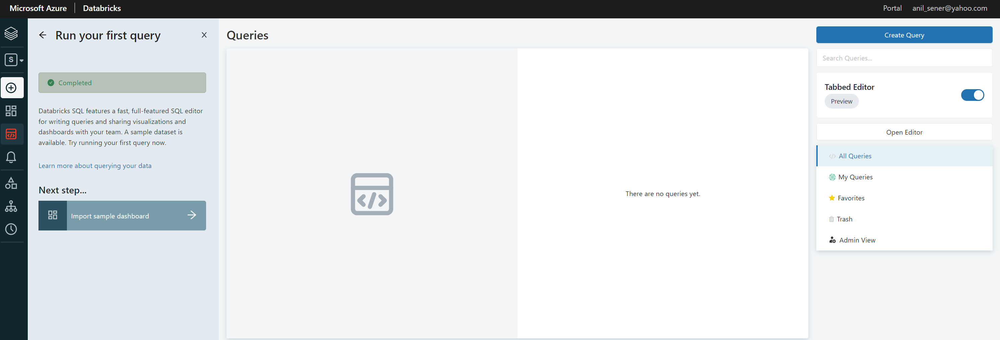
</p>

7. Select the created and started SQL Endpoint in the New Query Editor:
<p align="center">
  
</p>

8. Copy and select the commands below in the Query Editor and the click <b>Run Selected</b> button to execute the commands:
```
GRANT  USAGE
  ON DATABASE testdb
  TO
`LoanGroup`;

GRANT  USAGE
  ON DATABASE testdb
  TO
`IoTDevicesGroup`;

GRANT READ_METADATA,`SELECT`, MODIFY
ON TABLE testdb.iot_devices 
  TO
`IoTDevicesGroup`;


GRANT READ_METADATA,`SELECT`, MODIFY
ON TABLE testdb.loans 
  TO
`LoanGroup`;

DENY READ_METADATA,`SELECT`, MODIFY
ON TABLE testdb.iot_devices 
  TO
`LoanGroup`;

DENY READ_METADATA,`SELECT`, MODIFY
ON TABLE testdb.loans 
  TO
`IoTDevicesGroup`;
```

<p align="center">
  
</p>

9. (Optional) Click to <b>Grant Permissions</b> item on the popup menu near the Databricks Menu, find `testdb` and check permissions. Check the permissions for the tables as well:
<p align="center">
  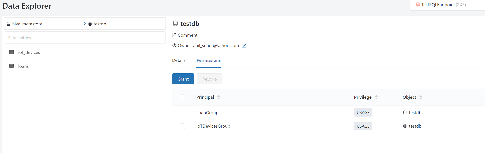
</p>

<p align="center">
  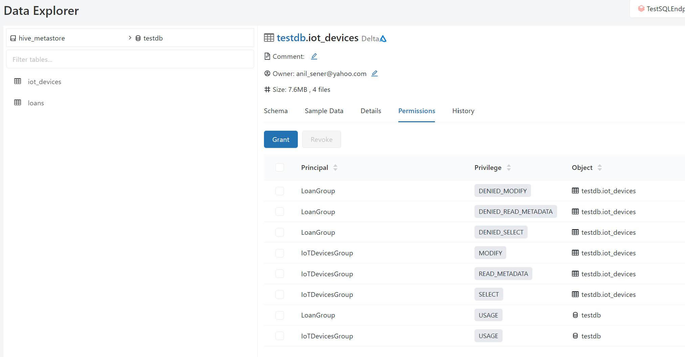
</p>

<p align="center">
  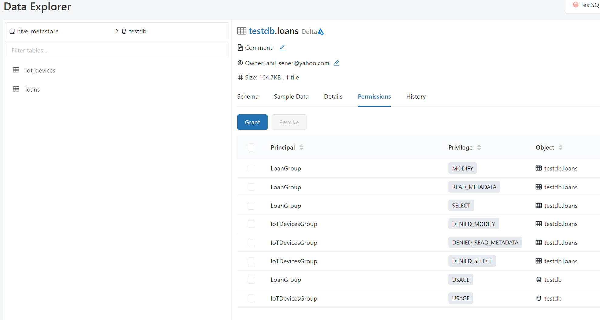
</p>


10. Navigate to the premium Azure Databricks <b>Workspace > Overview</b> on Azure Portal and click Launch Workspace button, choose and <b>TestUser1</b> user to login. When Azure Databricks Workspace is displayed, navigate to <b>Workspace</b>, then upload [pattern6-table-access-control.ipynb](notebooks/testuser1/pattern6-table-access-control.ipynb) notebook to the Databricks Workspace and open the notebook, attach & start the cluster created in step 1 and then run all cells: 
<p align="center">
  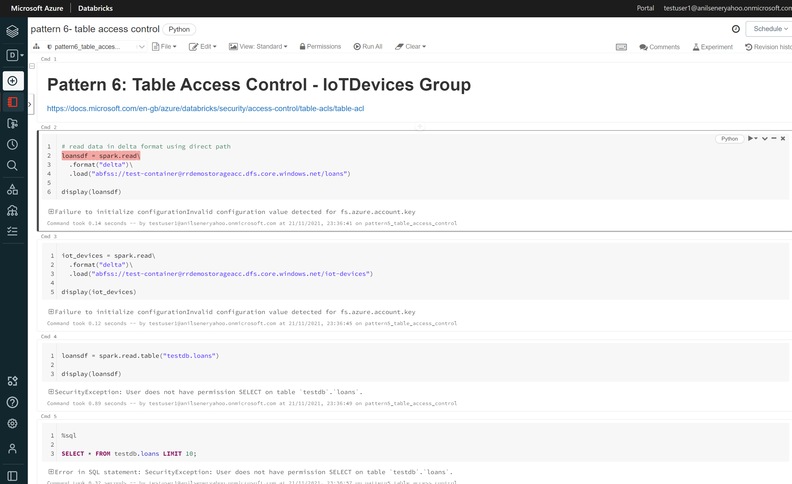
</p>

<p align="center">
  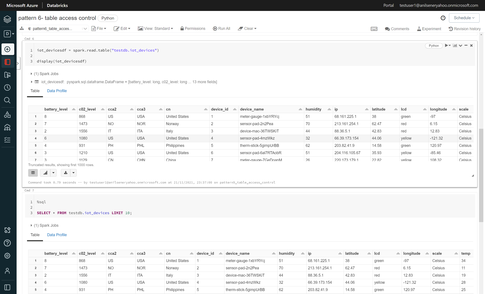
</p>

<i>RESULT: Neither of the file paths are directly accessible anymore. IotDevicesGroup Databricks Group users can only access to `testdb.iot_devices` table, the user received an explicity privilidge exception for `testdb.loans` table. These permissions are limited thanks to the privileges granted & denied by Databricks Table Control.</i> 


11. Navigate to the premium Azure Databricks <b>Workspace > Overview</b> on Azure Portal and click Launch Workspace button, choose and <b>TestUser2</b> user to login. When Azure Databricks Workspace is displayed, navigate to <b>Workspace</b>, then upload [pattern6-table-access-control.ipynb](notebooks/testuser2/pattern6-table-access-control.ipynb) notebook to the Databricks Workspace and open the notebook, attach & start the cluster created in step 1 and then run all cells: 
<p align="center">
  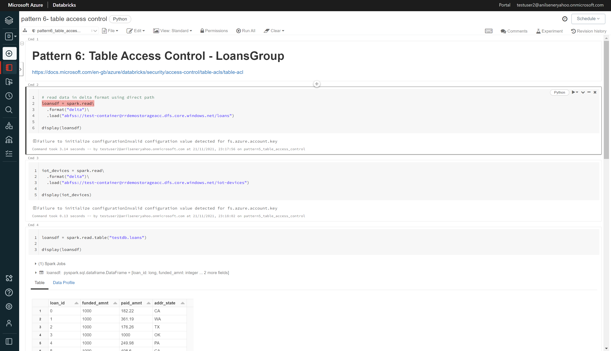
</p>

<p align="center">
  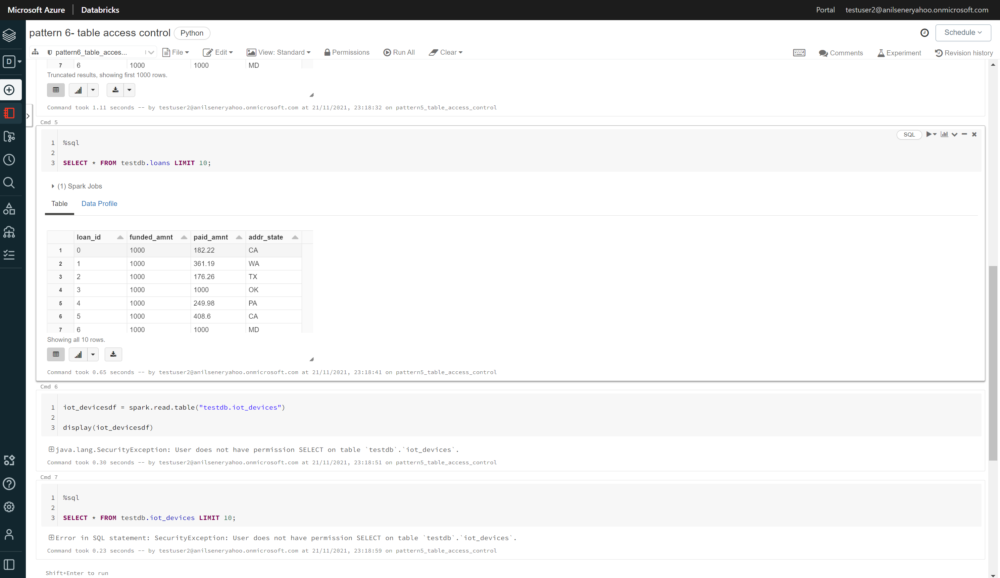
</p>

<i>RESULT: Neither of the file paths are directly accessible anymore. LoansGroup Databricks Group users can only access to `testdb.loans` table, the user received an explicity privilidge exception for `testdb.iot_devices` table. These permissions are limited thanks to the privileges granted & denied by Databricks Table Control.</i> 


## License/Terms of Use

This is a free white paper released into the public domain.

Anyone is free to use or distribute this white paper, for any purpose,
commercial or non-commercial, and by any means.

THE WHITE PAPER IS PROVIDED \"AS IS\", WITHOUT WARRANTY OF ANY KIND,
EXPRESS OR IMPLIED, INCLUDING BUT NOT LIMITED TO THE WARRANTIES OF
MERCHANTABILITY, FITNESS FOR A PARTICULAR PURPOSE AND NONINFRINGEMENT.

IN NO EVENT SHALL THE AUTHORS BE LIABLE FOR ANY CLAIM, DAMAGES OR OTHER
LIABILITY, WHETHER IN AN ACTION OF CONTRACT, TORT OR OTHERWISE, ARISING
FROM, OUT OF OR IN CONNECTION WITH THE WHITE PAPER.

