# Preparation Steps 

**Summary:**

This document provides the preparation steps required to execute all tutorials.

**Versions:**

| **Name** | **Title** | **Notes** | **Date** |
| --- | --- | --- | --- |
| Anil Sener | Microsoft Cloud Solution Architect – Data &amp; AI | Original | 01 December 2021 |
|   |   |   |   |

# Contents

[Pre-requisites](#Pre-requisites)

[Tutorial Steps](#Tutorial-Steps)

[License/Terms of Use](#License/Terms-of-Use)

## Pre-requisites

This tutorial requires the completion of the steps in [Connecting securely to ADLS from ADB](../../Readme.md#connecting-securely-to-adls-from-adb) section.

## Tutorial Steps
1. Navigate to <b>Azure Active Directory > Users</b> and then create two users as below:

  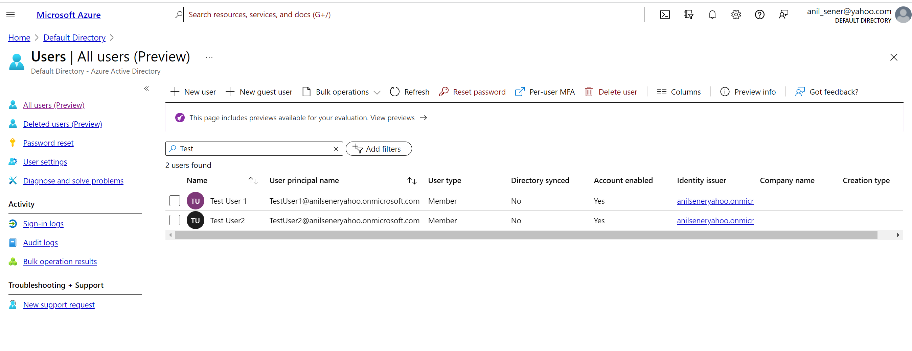

2. Navigate to <b>Azure Active Directory > Groups</b> and then create two users as below:

  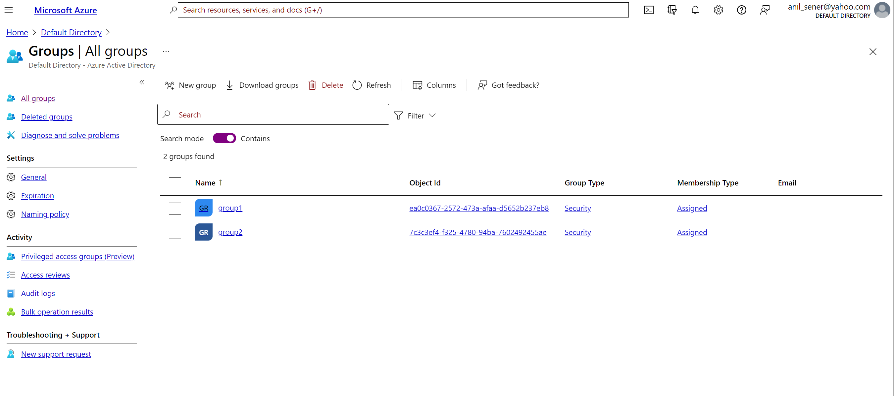

3. Click on <b>group1</b> and then navigate to members and add <b>TestUser1</b>:

  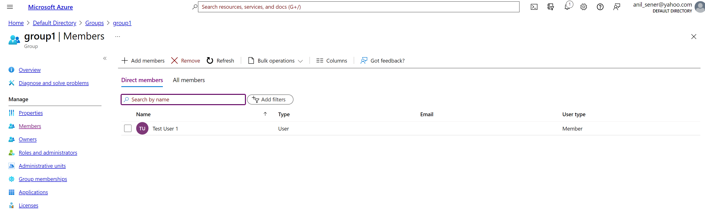

4. Click on <b>group2</b> and then navigate to members and add <b>TestUser2</b>:

  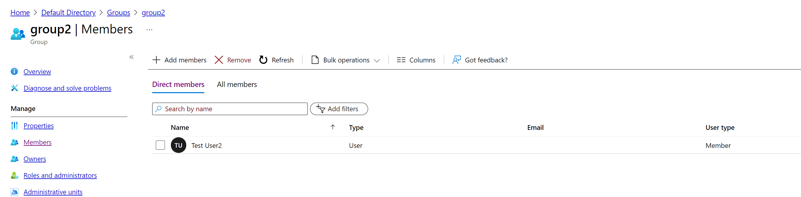

5. Navigate to the <b>Storage Accounts</b>, drill down to the storage account created in the setup steps and navigate to Containers. Then, create a container called <b>test_container</b> with the following settings.

  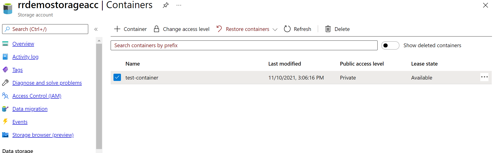

6. Navigate to the premium Azure Databricks Workspace created, navigate to <b>Access Control (IAM) > Role Assignments</b> tab and then add both of the AD groups as a Contributor:

  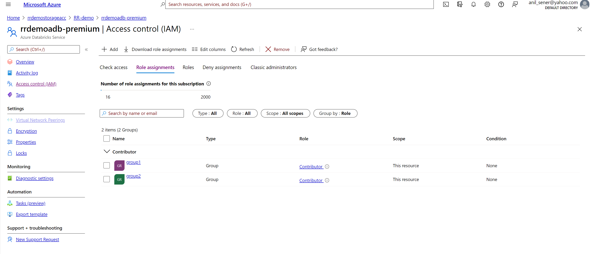

7. Navigate to the <b>premium Azure Databricks Workspace > Overview</b> and click <b>Launch Workspace</b> button, choose and <b>admin user</b> to login. When Azure Databricks Workspace is displayed, navigate to <b>Settings > Admin Console > Users</b>. Then, add two AD users created using their emails. Please ensure that they are not Admin users and they cannot create any cluster:

  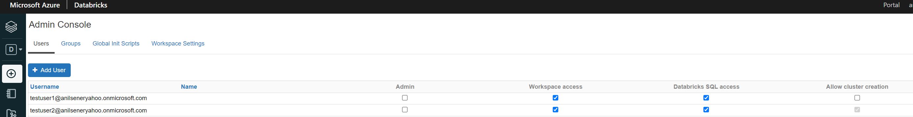

8. Navigate to <b>Settings > Admin Console > Groups</b>. Create two Databricks user groups called <b>IoTDevicesGroup</b> and <b>LoanGroup</b>.
Then, add two AD users created using their emails. Please ensure that they are not Admin users and they cannot create any cluster:

  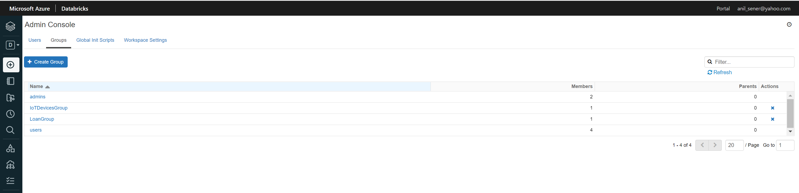

9. Click <b>IoTDevicesGroup</b> group and add <b>testuser1</b> as a member to the group:

  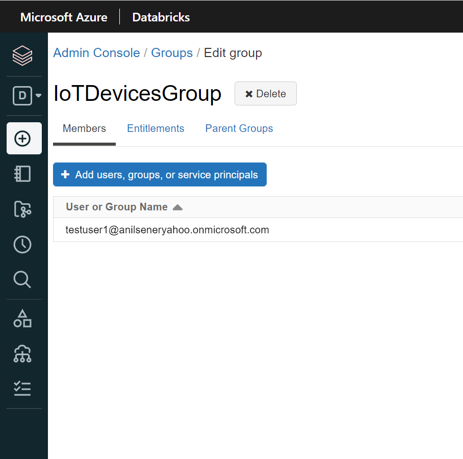

10. Click <b>LoanGroup</b> group and add <b>testuser2</b> as a member to the group:

  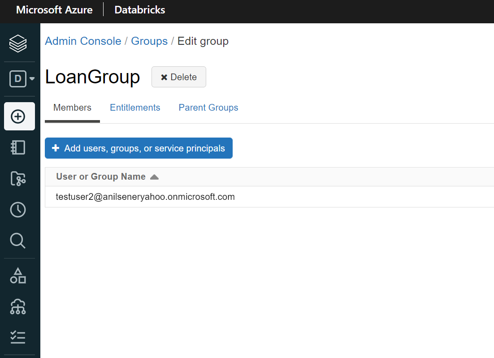

11. Navigate to <b>Settings > Admin Console > Workspace Settings</b>. Please ensure that all the following access control settings are enabled:

  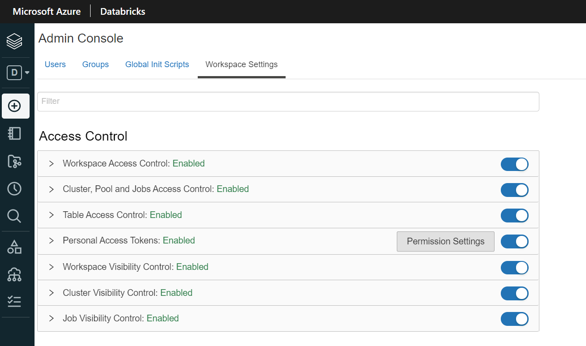

12. Navigate to <b>Compute</b> and create a single node cluster with the following settings:

  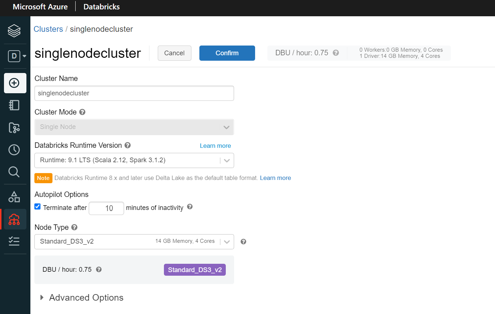

13. Navigate to <b>Workspace</b> and upload [Preparation.ipynb](notebooks/Preparation.ipynb) to the Databricks Workspace and open the notebook, attach the cluster created in the previous step and start the cluster. When the cluster is ready please run all the cells in the notebook:

  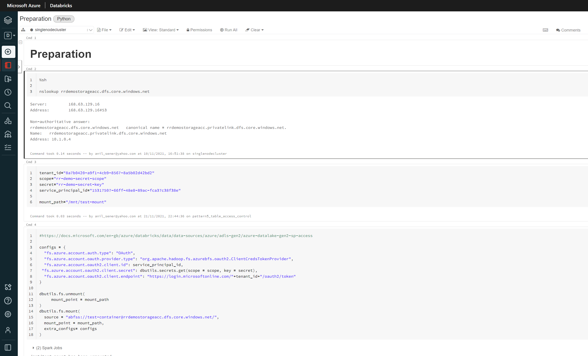

<i>RESULT: This notebook will create <b>iot_devices</b> and <b>loans</b> folders under <b>test_container</b> using example databricks-datasets which will be essential for all patterns demonstrated in the tutorials. Last cell which creates two databricks tables is a pre-condition for only pattern 6.</i>

## License/Terms of Use

This is a free white paper released into the public domain.

Anyone is free to use or distribute this white paper, for any purpose,
commercial or non-commercial, and by any means.

THE WHITE PAPER IS PROVIDED \"AS IS\", WITHOUT WARRANTY OF ANY KIND,
EXPRESS OR IMPLIED, INCLUDING BUT NOT LIMITED TO THE WARRANTIES OF
MERCHANTABILITY, FITNESS FOR A PARTICULAR PURPOSE AND NONINFRINGEMENT.

IN NO EVENT SHALL THE AUTHORS BE LIABLE FOR ANY CLAIM, DAMAGES OR OTHER
LIABILITY, WHETHER IN AN ACTION OF CONTRACT, TORT OR OTHERWISE, ARISING
FROM, OUT OF OR IN CONNECTION WITH THE WHITE PAPER.

